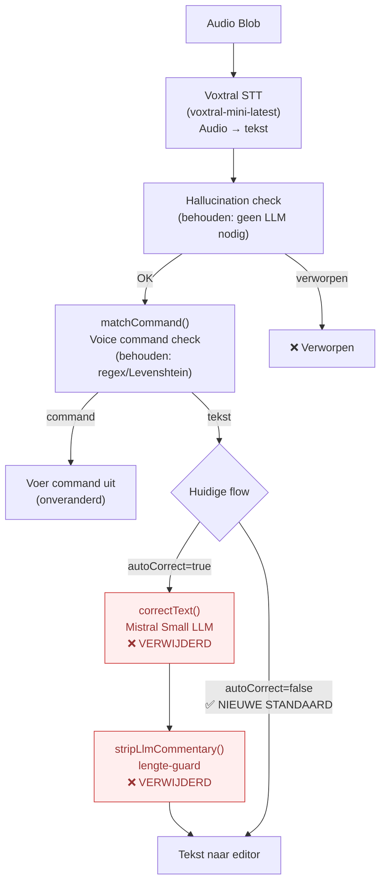
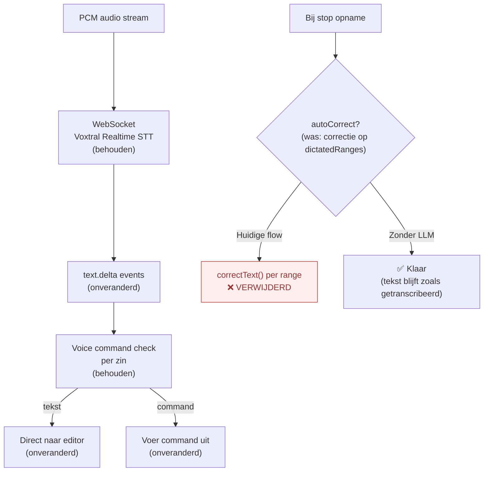
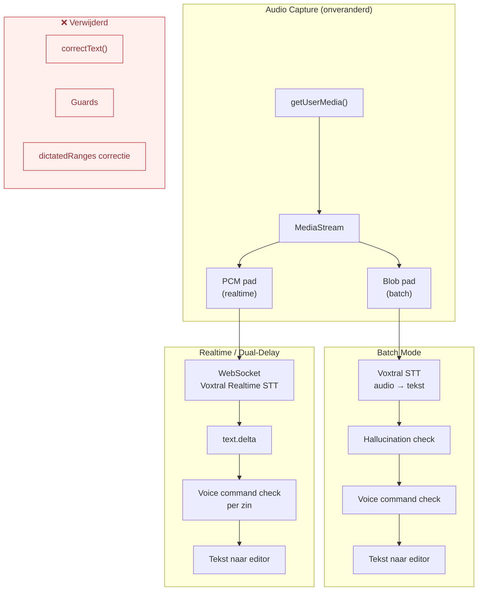

# Audio Processing Flow — Zonder LLM Correctie

Wat verandert er als we de LLM-correctiestap (Mistral Chat / `correctText()`) volledig uitschakelen?

> **TL;DR**: De kern van de transcriptie (spraak → tekst) en alle voice commands blijven **volledig intact**. Alleen de automatische tekst-opschoning na transcriptie verdwijnt. De impact is beperkt tot typografische kwaliteit.

---

## Wat is "de LLM" in deze context?

Er worden **twee modellen** gebruikt in Voxtral Transcribe:

| Model | Type | Doel | Verwijderbaar? |
|-------|------|------|---------------|
| **Voxtral** (`voxtral-mini-latest` / `voxtral-mini-transcribe-realtime-2602`) | Speech-to-Text | Audio → tekst omzetten | **Nee** — dit IS de transcriptie |
| **Mistral Small** (`mistral-small-latest`, configureerbaar via `correctModel`) | Chat/LLM | Tekst → gecorrigeerde tekst | **Ja** — dit is de auto-correct |

Dit document beschrijft het scenario waarin we **Mistral Small (de correctie-LLM) uitschakelen** maar Voxtral (de transcriptie) behouden.

---

## Huidige flow vs flow zonder LLM

### Batch Mode

### Streaming / Dual-Delay Mode

---

## Impact-analyse per functie

### Geen impact (onveranderd)

| Functie | Waarom onveranderd |
|---------|-------------------|
| **Audio capture** | Geen LLM betrokken — puur WebRTC/AudioWorklet |
| **Noise suppression** | Browser-level `getUserMedia()` constraint |
| **Typing mute** | `track.enabled` toggle, geen LLM |
| **Focus pause** | `visibilitychange` handler, geen LLM |
| **Voice commands** | Regex pattern matching + Levenshtein distance, geen LLM |
| **Hallucination detection** | Heuristische checks (woorden/sec, herhalingen), geen LLM |
| **Offline queue** (web) | Wachtrij voor transcriptie-uploads, geen correctie-stap |
| **Diarize** (web) | Spreker-segmentatie door Voxtral STT, geen LLM |
| **Mic level indicator** (web) | AnalyserNode RMS berekening |
| **dictatedRanges tracking** | Offset-administratie blijft werken (maar wordt niet meer gebruikt voor correctie) |

### Verdwijnt volledig

| Functie | Locatie | Wat het deed |
|---------|---------|-------------|
| **Auto-correct na batch** | `main.ts:566-567`, `app.js:1700-1706` | Capitalisatie, leestekens, spraakfouten corrigeren |
| **Auto-correct bij stop** (realtime/dual) | `main.ts:741-742`, `main.ts:1058-1059` | Dictated ranges achteraf corrigeren |
| **Handmatige correctie** | `main.ts:1260-1295` | Selectie of hele note corrigeren op verzoek |
| **stripLlmCommentary()** | `mistral-api.ts:279-294` | Guard tegen LLM-hallucinaties in correctie — niet meer nodig |
| **Lengte-guard (1.5x+50)** | `mistral-api.ts:258-273` | Guard tegen opgeblazen output — niet meer nodig |
| **Inline correctie-instructies** | Onderdeel van system prompt | "Voor de correctie: ..." instructies in dictaat — worden niet meer uitgevoerd |

### Merkbaar effect op output-kwaliteit

| Aspect | Met LLM | Zonder LLM |
|--------|---------|------------|
| **Capitalisatie** | Zinnen beginnen met hoofdletter, eigennamen gecorrigeerd | Afhankelijk van Voxtral STT output — vaak al redelijk maar inconsistent |
| **Leestekens** | Ontbrekende punten/komma's aangevuld | Alleen wat Voxtral zelf produceert (basisleestekens) |
| **Spraakherkenningsfouten** | "Nee der land" → "Nederland" | Blijft staan zoals Voxtral het hoort |
| **Spellingsfouten** | Gecorrigeerd door LLM | Blijven staan |
| **Inline instructies** | "Voor de correctie: met een hoofdletter" → uitgevoerd en verwijderd | Blijven letterlijk in de tekst staan als dictaat |
| **Meta-commentaar** | "Dat is een Nederlands woord" → verwijderd | Blijft staan in de tekst |
| **Markdown formatting** | Behouden door LLM (expliciet in prompt) | Behouden (voice commands genereren markdown, LLM raakte dit niet aan) |

---

## Wat kost de LLM?

### Per API-aanroep

| Aspect | Detail |
|--------|--------|
| **Model** | `mistral-small-latest` (of configureerbaar via `correctModel`) |
| **Temperature** | 0.1 (conservatief) |
| **Tokens** | ~input lengte + ~output lengte (roughly 1:1 ratio) |
| **Latency** | 200-800ms per correctie (afhankelijk van tekstlengte) |
| **Kosten** | Mistral Small pricing per token |

### Wanneer wordt het aangeroepen

| Modus | Moment | Frequentie |
|-------|--------|-----------|
| **Batch** | Na elke transcriptie-chunk | 1× per chunk (bij stop of send) |
| **Realtime single** | Bij stop opname | 1× per dictated range (kan meerdere zijn) |
| **Dual-delay** | Bij stop opname | 1× per dictated range |
| **Handmatig** | Op verzoek (command) | 1× |

---

## Vereenvoudigde flow zonder LLM

---

## Code-impact: wat kan weg?

Als `autoCorrect` permanent uit staat (of de code verwijderd wordt):

| Bestand | Wat kan weg | Regels |
|---------|------------|--------|
| `mistral-api.ts` | `correctText()`, `stripLlmCommentary()`, lengte-guard | ~80 regels (220-294) |
| `main.ts` | `autoCorrectAfterStop()`, correctie-aanroepen in batch/realtime handlers, handmatig-correct command | ~100 regels |
| `main.ts` | `dictatedRanges` tracking (alleen gebruikt voor correctie-scope) | ~70 regels (1118-1242) |
| `app.js` | `correctText()`, `autoCorrectAfterStop()`, auto-correct toggle UI | ~60 regels |
| `server.py` | `/api/correct` endpoint | ~30 regels (247-275) |
| `types.ts` | `autoCorrect`, `correctModel` settings | 2 regels |
| `settings-tab.ts` | Auto-correct toggle, correct model input | ~20 regels |
| **Totaal** | | **~360 regels** |

### Wat NIET weg kan

| Component | Reden |
|-----------|-------|
| Voxtral STT (`transcribeBatch`, `RealtimeTranscriber`) | Dit is de kern-transcriptie |
| `isLikelyHallucination()` | Checkt STT-output, niet LLM-output |
| Voice commands (`matchCommand`, `processText`) | Regex-gebaseerd, geen LLM |
| `DEFAULT_CORRECT_PROMPT` | Kan weg (alleen gebruikt door `correctText`) |

---

## Aanbeveling

De LLM-correctie is een **kwaliteitslaag**, geen functionele vereiste. Uitschakelen (`autoCorrect: false`) is al mogelijk via de instellingen en heeft **geen neveneffecten** op de rest van de pipeline.

Als je de correctie niet gebruikt, merk je:
1. **Geen verschil** in voice commands, formatting, of opname-flow
2. **Licht lagere kwaliteit** in capitalisatie en leestekens (afhankelijk van hoe goed Voxtral het doet)
3. **Inline correctie-instructies** ("voor de correctie: ...") blijven letterlijk in je tekst staan — dit is het meest zichtbare verschil als je die dicteer-workflow gebruikt
4. **Snellere verwerking** — geen wachttijd op correctie-API
5. **Lagere kosten** — geen Mistral Small tokens verbruikt
