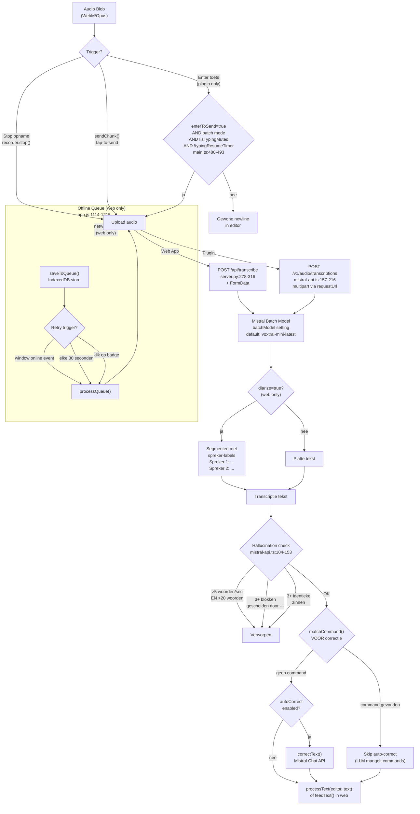
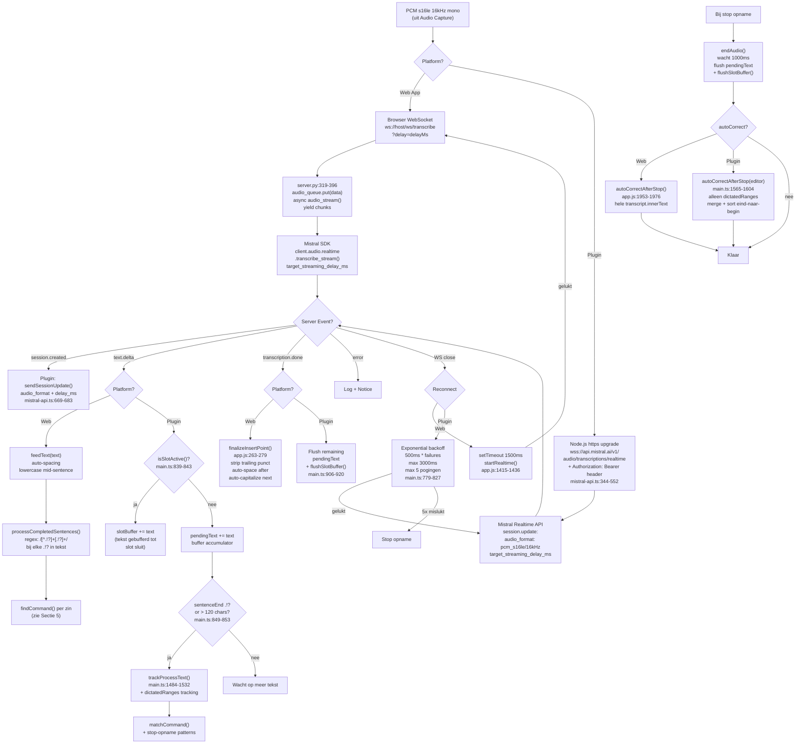
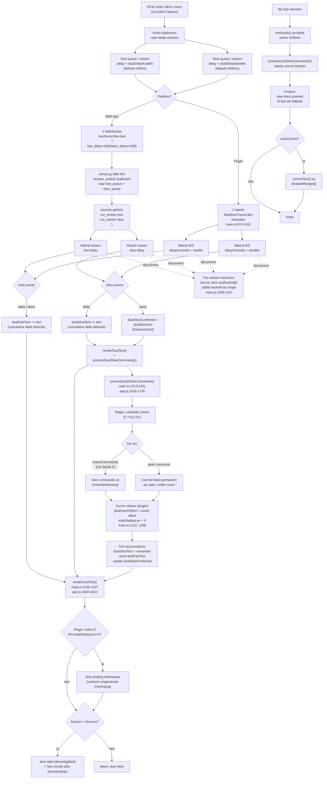
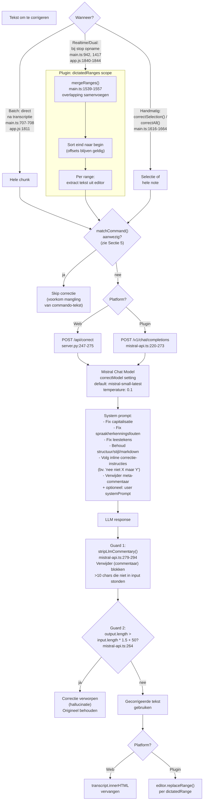
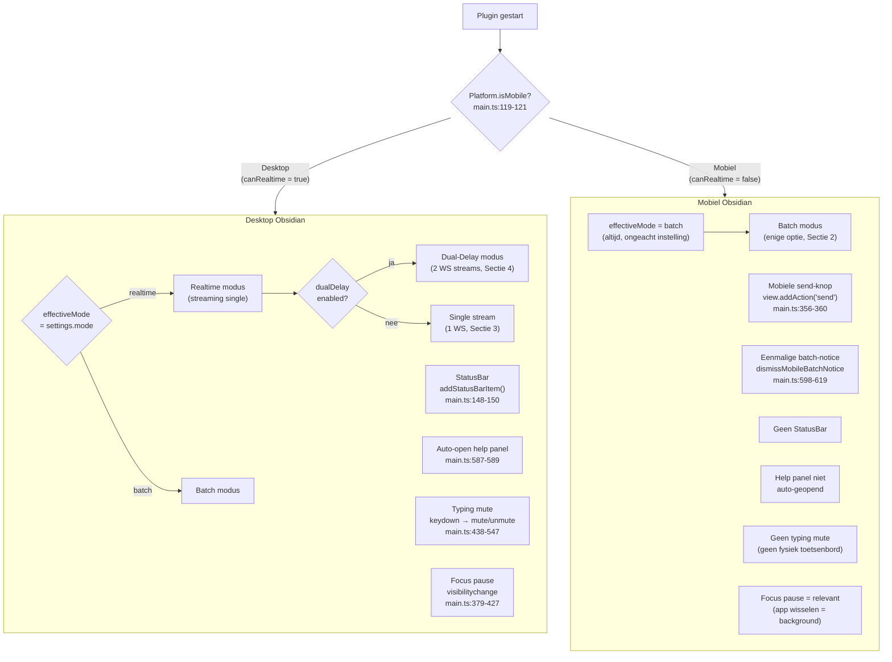
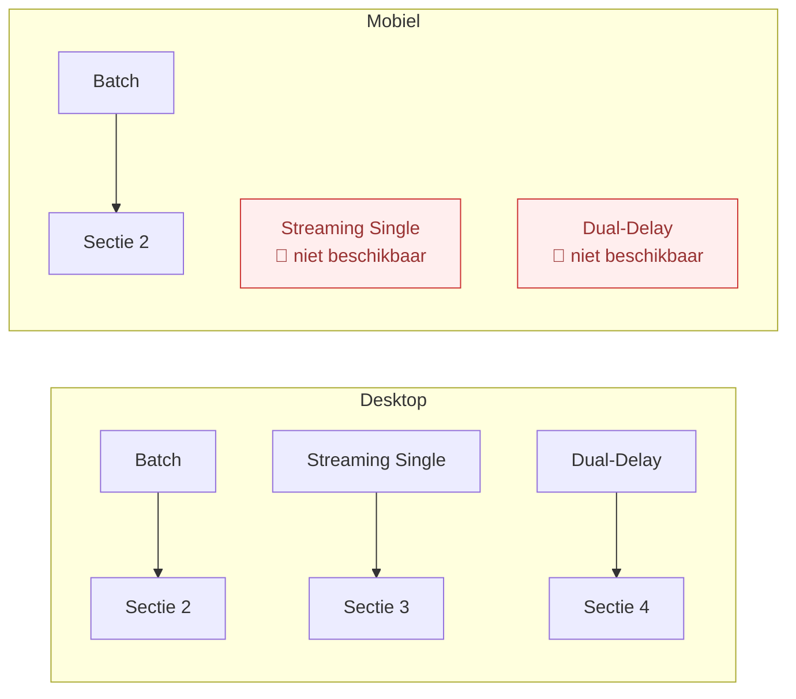

# Audio Processing Flow — Voxtral Transcribe (Gedetailleerd)

Alle audioverwerkingsstromen in de **Web App** en **Obsidian Plugin**, tot op functie-niveau.

---

## 1. Audio Capture

---

## 2. Batch Mode

---

## 3. Streaming Single

---

## 4. Dual-Delay Mode

---

## 5. Voice Command Pipeline

Elke voltooide zin uit de transcriptie (batch, realtime, dual-delay) doorloopt deze pipeline.
In de **plugin** verwerkt `processText()` (voice-commands.ts:621-638) de zinnen; in de **web app**
doet `processCompletedSentences()` (app.js:740-812) hetzelfde.

```mermaid
flowchart TB
    RAW["Voltooide zin\nuit transcriptie"]

    RAW --> PREMATCH{"preMatchHook?\nvoice-commands.ts:642-644"}
    PREMATCH -- "template match" --> TEMPLATE["Template invoegen\n(quick-template of user-template\nvia setupTemplates, main.ts:245-300)"]
    PREMATCH -- "geen match" --> NORM

    NORM["normalizeCommand()\nvoice-commands.ts:97-105\n1. NFD + strip combining chars\n   (e met trema -> e)\n2. replace hyphens met spaties\n3. strip leestekens (.,!?;:'\n   en haakjes)\n4. toLowerCase()\n5. trim()"]
    NORM --> MISHEAR["fixMishearings(lang)\nvoice-commands.ts:108-113\nlang.ts:619-637\n\nnl: niveau/niva->nieuwe\nnl: beeindigde->beeindig de\nnl: linea/linie->alinea\nnl: nieuw alinea->nieuwe alinea\nnl: nieuw regel->nieuwe regel\nfr: nouveau ligne->nouvelle ligne\nfr: nouvelle paragraphe->nouveau paragraphe\nde: neue absatz->neuer absatz\nde: neues zeile->neue zeile"]

    MISHEAR --> MATCH["matchCommand()\nvoice-commands.ts:468-602"]

    subgraph MATCH_PASSES["Matching pipeline (eerste match wint)"]
        P1["Pass 1: Exact match\nnormalized.endsWith(pattern)"]
        P1 -- "geen match" --> P2["Pass 2: Strip trailing fillers\n(alsjeblieft, please, etc.)\nphonetics.ts:181-193"]
        P2 -- "geen match" --> P2B["Pass 2b: Strip leading articles\nuit trailing portion\n(de, het, een, the, a)\nphonetics.ts:160-175"]
        P2B -- "geen match" --> P3["Pass 3: Phonetic normalization\nphonetics.ts:145-154\n(ij↔ei, ph→f, etc.)"]
        P3 -- "geen match" --> P4["Pass 4: Compound-word split\n(nieuwealinea → nieuwe alinea)\nphonetics.ts:201-216"]
        P4 -- "geen match" --> P5["Pass 5: Fuzzy match\nLevenshtein < 3\nmin 6 chars, max 3 len verschil\nvoice-commands.ts:582-601"]
    end

    MATCH --> MATCH_PASSES
    P1 -- match --> SPLIT["Splits textBefore + command\nop basis van woordtelling"]
    P2 -- match --> SPLIT
    P2B -- match --> SPLIT
    P3 -- match --> SPLIT
    P4 -- match --> SPLIT
    P5 -- match --> SPLIT2["textBefore = leeg\n(hele zin is command)"]
    P5 -- "geen match" --> PLAIN["Gewone tekst invoegen\ninsertAtCursor()"]

    SPLIT --> EXEC
    SPLIT2 --> EXEC

    EXEC["Execute command"]
    EXEC --> TB_CHECK{"textBefore\naanwezig?"}
    TB_CHECK -- ja --> INSERT_TB["Insert textBefore\nin editor/transcript"]
    TB_CHECK -- nee --> ACTION

    INSERT_TB --> PUNCT{"command.punctuation\n= true?"}
    PUNCT -- ja --> STRIP_P["Strip trailing\npunctuation van\ntextBefore"]
    PUNCT -- nee --> ACTION
    STRIP_P --> ACTION

    ACTION{"Command type?"}

    ACTION -- "Insert" --> INS_CMDS
    ACTION -- "Slot (plugin only)" --> SLOT_CMDS
    ACTION -- "Delete / Control" --> DEL_CMDS
    ACTION -- "Custom" --> CUSTOM_CMDS

    subgraph INS_CMDS["Insert Commands"]
        A1["newParagraph: \\n\\n"]
        A2["newLine: \\n"]
        A3["heading1/2/3: \\n\\n# / ## / ###"]
        A4["bulletPoint: \\n- "]
        A5["todoItem: \\n- [ ] "]
        A6["numberedItem: auto-increment\nzoek laatste N. → \\nN+1. "]
        A7["colon: strip trailing punct\n+ insert ': '"]
    end

    subgraph SLOT_CMDS["Slot Commands (plugin only)\nvoice-commands.ts:264-339"]
        S1["wikilink: [[ cursor ]]"]
        S2["bold: ** cursor **"]
        S3["italic: * cursor *"]
        S4["inlineCode: backtick cursor backtick"]
        S5["tag: # cursor\n(exit bij enter of spatie)"]
    end

    subgraph DEL_CMDS["Delete / Control"]
        A8["deleteLastParagraph:\nverwijder na laatste \\n\\n"]
        A9["deleteLastLine:\nverwijder na laatste .!? of \\n"]
        A10["undo: editor.undo()"]
        A11["stopRecording:\nsetTimeout 0ms stopRecording()"]
    end

    subgraph CUSTOM_CMDS["Custom Commands\nvoice-commands.ts:349-380\ngeladen via loadCustomCommands()"]
        CC1{"type?"}
        CC1 -- insert --> CC_INS["insertText invoegen\n(zelfde als built-in insert)"]
        CC1 -- slot --> CC_SLOT["Open slot met\nslotPrefix / slotSuffix\nexit via slotExit trigger"]
    end

    SLOT_CMDS --> SLOT_SYS
    CC_SLOT --> SLOT_SYS

    subgraph SLOT_SYS["Slot System\nvoice-commands.ts:59-94\nmain.ts:839-843, 906-920"]
        SL_OPEN["openSlot(): prefix invoegen\nactiveSlot instellen"]
        SL_OPEN --> SL_BUFF["Inkomende dictatie gaat\nnaar slotBuffer\n(i.p.v. pendingText,\nzie Sectie 3)"]
        SL_BUFF --> SL_EXIT{"Exit trigger?\n(enter / space /\nenter-or-space)"}
        SL_EXIT -- ja --> SL_CLOSE["closeSlot(): suffix invoegen\nflushSlotBuffer()\nmain.ts:906-920"]
        SL_EXIT -- "cancel command" --> SL_CANCEL["cancelSlot(): suffix\noverslaan, buffer flushen"]
    end
```

---

## 6. Text Correction Pipeline

Correctie kan automatisch of handmatig getriggerd worden. In de **web app** wordt altijd
de hele transcript gecorrigeerd; in de **plugin** alleen de `dictatedRanges[]` (precise tracking
van wat daadwerkelijk gedicteerd is, zie Sectie 3 en 4).

---

## Waar wordt elke optie toegepast?

| Optie | Waar in code | Wanneer | Effect |
|-------|-------------|---------|--------|
| **noiseSuppression** | `audio-recorder.ts:93-97`, `app.js:1358-1361` | Bij `getUserMedia()` start | Browser WebRTC: noiseSuppression + echoCancellation + autoGainControl |
| **Typing mute** | `main.ts:438-547` | Elke keydown tijdens opname (plugin) | `track.enabled=false`, unmute na `typingCooldownMs` (800ms) |
| **Focus pause** | `main.ts:379-427` | `visibilitychange` event (plugin) | `recorder.pause()` + `track.enabled=false` |
| **Hallucination check** | `mistral-api.ts:104-153` | Na batch transcriptie (plugin) | Verwerp als >5w/s, herhaalde blokken, of identieke zinnen |
| **Auto-correct** | `main.ts:707-708`, `main.ts:1463-1464`, `app.js:1953-1976` | Batch: direct. Realtime: bij stop | `correctText()` via Mistral Chat, skip bij voice commands |
| **Manual correction** | `main.ts:1616-1664` | Handmatig via knop/command (plugin) | `correctSelection()` of `correctAll()` onafhankelijk van auto-correct |
| **Correction guards** | `mistral-api.ts:258-264` (aanroep), `mistral-api.ts:279-294` (impl) | Na elke correctie-response | `stripLlmCommentary()` + lengte-check (1.5x + 50) |
| **Enter-to-send** | `main.ts:480-493` | Keydown Enter in batch mode (plugin) | `sendChunk()` als mic niet gedempt |
| **Diarize** | `server.py:291-311` | Batch transcriptie (web only) | Spreker-segmenten in response |
| **Offline queue** | `app.js:1114-1215` | Netwerk fout bij batch upload (web) | IndexedDB opslag, auto-retry |
| **dictatedRanges** | `main.ts:1484-1531`, `main.ts:1565-1604` | Tijdens realtime/dual dictatie (plugin) | Track ingevoegde bereiken voor precise auto-correct |
| **Mic level** | `app.js:1265-1320` | Tijdens opname (web only) | AnalyserNode RMS + slow EMA → status indicator |
| **Custom commands** | `voice-commands.ts:349-380` | Bij alle transcriptie modi | Gebruiker-gedefinieerde commando's, type insert of slot |
| **Slot system** | `voice-commands.ts:43-94`, `main.ts:906-920` | Bij slot-commands (wikilink, bold, etc.) | Prefix/suffix patroon met gebufferde dictatie |

---

## Platform-architectuur verschil

| Aspect | Web App | Plugin |
|--------|---------|--------|
| **Audio capture** | `ScriptProcessor` (legacy) | `AudioWorklet` (modern) |
| **WS transport** | Browser WS → server.py proxy → Mistral SDK | Node.js `https` manual upgrade → direct Mistral API |
| **WS auth** | Geen (lokale server beheert key) | `Authorization: Bearer` header op upgrade request |
| **Dual-delay** | 1 WS, server dupliceert naar 2 Mistral streams | 2 aparte WS verbindingen naar Mistral (2x API quota) |
| **Reconnect** | `setTimeout(1500ms)` → `startRealtime()` | Exponential backoff `500ms * n`, max 3000ms, max 5x |
| **Voice commands** | `processCompletedSentences()` bij elke delta | Buffer in `pendingText`, flush bij `.!?` of >120 chars |
| **Auto-correct scope** | Hele transcript na stop | Alleen `dictatedRanges[]` (precise tracking) |
| **Typing mute** | Niet beschikbaar | `keydown` → `mute()` → cooldown → `unmute()` |
| **Focus handling** | Niet beschikbaar | pause / pause-after-delay / keep-recording |
| **Custom commands** | Niet beschikbaar | `loadCustomCommands()` + UI editor modal |
| **Slot commands** | Niet beschikbaar | wikilink, bold, italic, inlineCode, tag |
| **Manual correction** | Niet beschikbaar | `correctSelection()` + `correctAll()` commands |
| **Mobile** | Volledig (PWA + offline queue) | Forced batch (geen WS custom headers) |
| **Rate limiting** | `MAX_WS_CONNECTIONS=4` (server) | Geen (directe API) |

---

## 7. Obsidian Plugin: Mobiel vs Desktop

De plugin gebruikt twee getters om platformverschillen af te handelen:
- `canRealtime` (main.ts:119-121): `return !Platform.isMobile`
- `effectiveMode` (main.ts:124-129): geeft `settings.mode` terug als `canRealtime`, anders altijd `"batch"`

### Settings per platform

Deze tabel gaat over de **plugin** (Obsidian). De web app draait alleen op desktop-browsers
en heeft geen Desktop/Mobiel onderscheid.

| Setting | Desktop | Mobiel | Reden |
|---------|---------|--------|-------|
| **mode** | `realtime` of `batch` (keuze) | Altijd `batch` (geforceerd) | `canRealtime = !Platform.isMobile` — geen custom WS headers op mobiel |
| **dualDelay** | Beschikbaar (als mode=realtime) | Niet bereikbaar | Realtime niet beschikbaar |
| **dualDelayFastMs / SlowMs** | Configureerbaar | Niet bereikbaar | Vereist realtime |
| **streamingDelayMs** | Configureerbaar | Niet bereikbaar | Vereist realtime |
| **enterToSend** | Ja, bij batch mode | Ja, bij batch mode | Op mobiel relevant met extern toetsenbord |
| **typingCooldownMs** | Actief (keydown handler) | Niet actief | Geen fysiek toetsenbord / geen handler |
| **focusBehavior** | Werkt (window focus) | Werkt (app-switch = background) | Relevanter op mobiel (vaker app-wissel) |
| **focusPauseDelaySec** | Werkt | Werkt | Alleen bij `pause-after-delay` |
| **noiseSuppression** | Werkt | Werkt | Browser-level via `getUserMedia()` |
| **autoCorrect** | Werkt | Werkt | Zelfde Mistral Chat API |
| **microphoneDeviceId** | Werkt (meerdere mics) | Werkt (meestal 1 mic) | Fallback bij fout |
| **customCommands** | Werkt (UI editor modal) | Werkt (UI editor modal) | Plugin-breed, niet platformspecifiek |
| **dismissMobileBatchNotice** | Niet getoond | Getoond (eenmalig) | Alleen zichtbaar op mobiel |

### Bereikbare verwerkingsstromen

