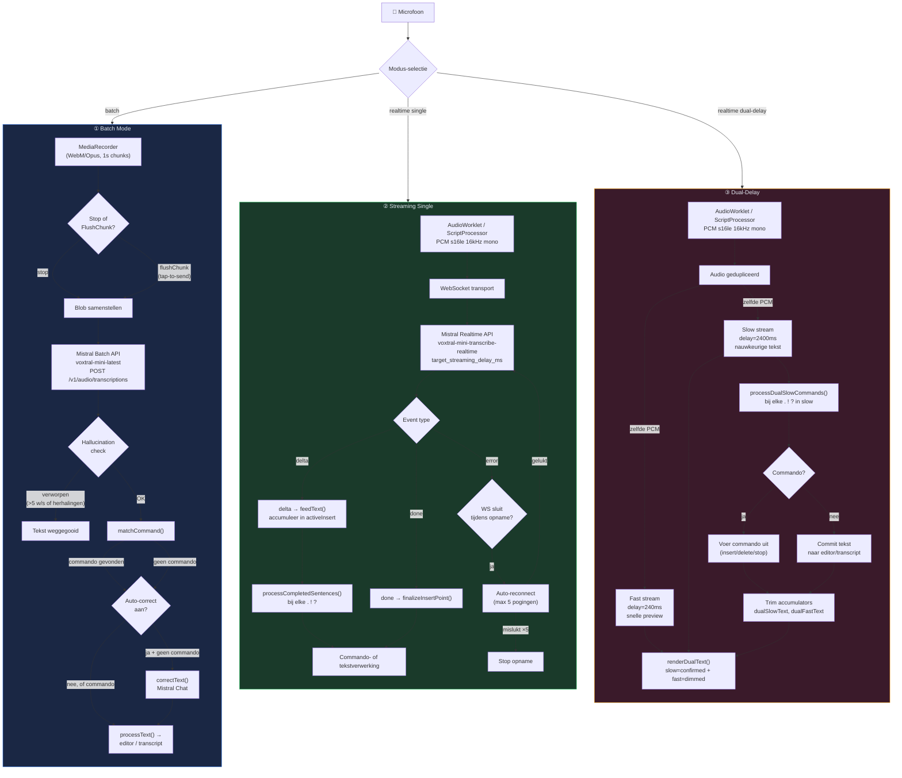
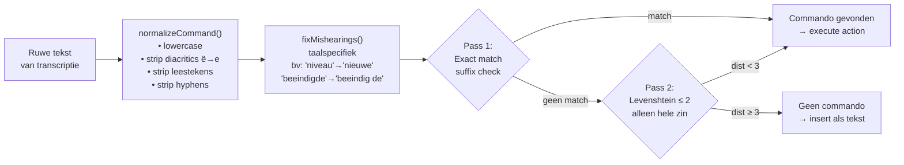
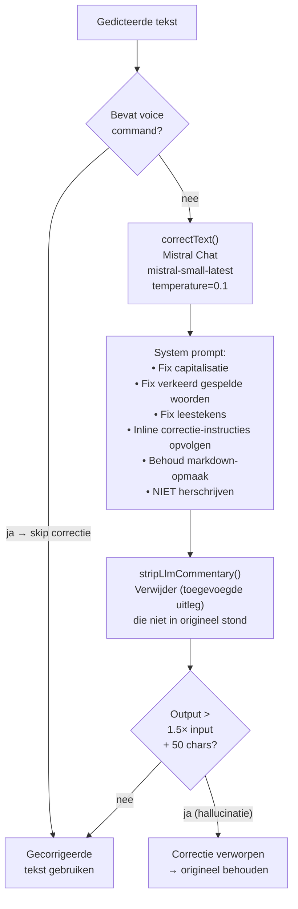
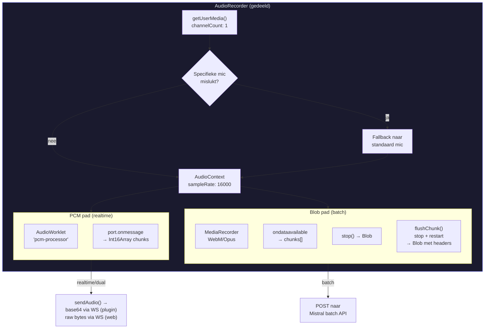
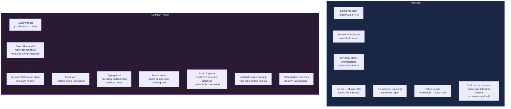

# Audio Processing Flow — Voxtral Transcribe

Dit document beschrijft de volledige audioverwerkingsketen voor zowel de **Web App** (`static/app.js` + `server.py`) als de **Obsidian Plugin** (`obsidian-plugin/src/`). Gebruik dit om vreemd gedrag te analyseren door te traceren waar in de keten iets misgaat.

---

## Overzichtsdiagram — Alle modi

---

## Gedetailleerd: Voice Command Processing

De commandoherkenning is identiek in alle drie de modi en in beide platformen. Dit is vaak de oorzaak van vreemd gedrag (commando's die niet herkend worden, of juist tekst die als commando wordt geinterpreteerd).

---

## Gedetailleerd: Tekst Correctie Pipeline

Wordt aangeroepen als `autoCorrect` aan staat. In batch mode: direct na transcriptie. In realtime/dual: na het stoppen van de opname, op alleen de gedicteerde ranges.

---

## Gedetailleerd: Audio Capture Layer

---

## Platform-verschillen: Web App vs Obsidian Plugin

---

## Verschilanalyse: Waar gedrag kan afwijken

| Aspect | Web App | Plugin | Mogelijke issues |
|---|---|---|---|
| **Audio transport** | ScriptProcessor + raw PCM bytes via WS | AudioWorklet + base64 JSON via WS | Worklet registratie kan falen op sommige platforms |
| **WS connectie** | Via server.py proxy | Direct naar Mistral API (Node.js https upgrade) | Auth header vereist Node.js — werkt niet op mobile |
| **Dual-delay architectuur** | 1 WS → server dupliceert naar 2 Mistral streams | 2 onafhankelijke WS verbindingen | Plugin gebruikt 2× API quota; timing kan afwijken |
| **Sentence detection** | Regex `[^.!?]+[.!?]+` op accumulated text | Zelfde regex op `pendingText` buffer | Bij realtime single: plugin buffert tot `\.[!?]\s*$` of >120 chars |
| **Command timing** | Direct bij elke delta (processCompletedSentences) | Pas bij sentence-end of >120 chars flush | Plugin kan commando's trager herkennen |
| **Auto-correct scope** | Niet beschikbaar in realtime (alleen batch) | Na stop: alleen dictatedRanges | Ranges kunnen verschuiven bij delete/undo commands |
| **Offline fallback** | IndexedDB queue → batch later | Geen offline support | Web app kan recordings kwijtraken bij crash voor opslag |
| **Reconnect** | setTimeout 1500ms → startRealtime() | Exponential backoff 500ms × failures (max 5) | Plugin is agressiever in reconnect |
| **Mobile** | Volledig ondersteund (PWA) | Forced batch mode (geen realtime WS) | Mobile Obsidian kan geen custom WS headers |
| **Typing mute** | Niet aanwezig | Mute mic bij keystroke, unmute na cooldown | Kan tekst verliezen als cooldown te kort is |
| **Focus behavior** | Geen handling | pause / pause-after-delay / keep-recording | Audio buffer kan vollopen bij lange achtergrond-pause |

---

## Debug Checklist

Bij vreemd gedrag, volg deze stroom:

1. **Geen tekst verschijnt**: Check mic-niveau → AudioContext sampleRate → WS connectie status → API key geldigheid
2. **Hallucinaties (herhalende/onzin tekst)**: Check `isLikelyHallucination()` drempels → audio te kort/stil? → typing mute actief?
3. **Commando niet herkend**: Check `normalizeCommand()` output → taal correct? → `fixMishearings()` patterns → Levenshtein afstand
4. **Commando onterecht herkend**: Check of tekst toevallig matcht → patronen te breed? → fuzzy match te agressief?
5. **Dual-delay timing issues**: Check of slow stream ver achterloopt → accumulators groeien oneindig? → `processDualSlowCommands()` trim-logica
6. **Tekst verdwijnt**: Check `deleteLastBlock()` / `restoreUndo()` → undo stack correct? → `dictatedRanges` offset-tracking na delete
7. **Correctie verminkt tekst**: Check of LLM commando-tekst herschrijft → `hasCommand` check voor correctie → `stripLlmCommentary()` te agressief?
8. **Reconnect loop**: Check `consecutiveFailures` teller → API rate limits → WebSocket close codes
