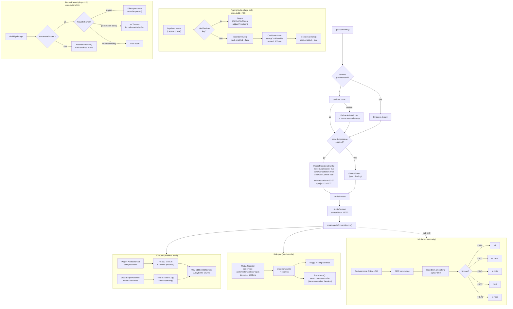
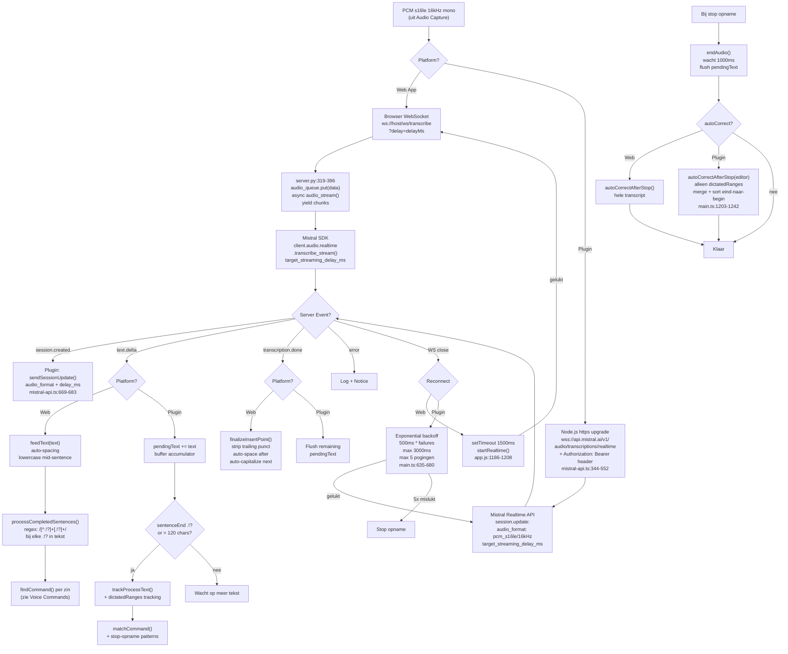
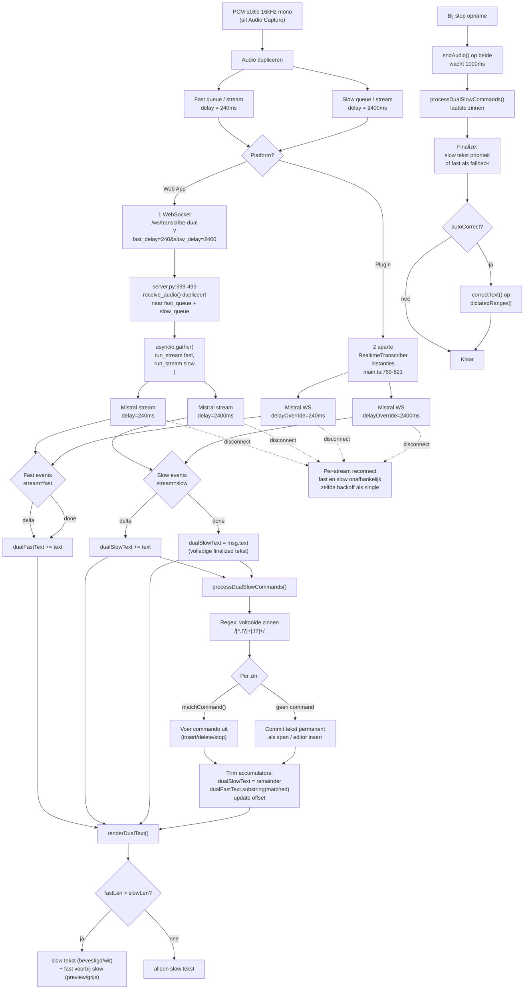
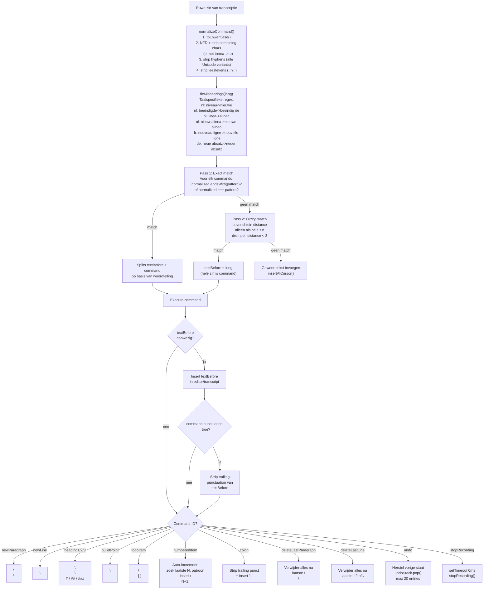
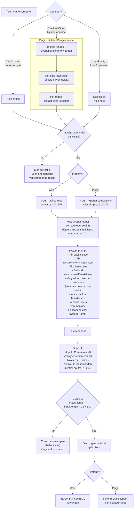

# Audio Processing Flow — Voxtral Transcribe (Gedetailleerd)

Alle audioverwerkingsstromen in de **Web App** en **Obsidian Plugin**, tot op functie-niveau.

---

## 1. Audio Capture

---

## 2. Batch Mode

---

## 3. Streaming Single

---

## 4. Dual-Delay Mode

---

## 5. Voice Command Pipeline

---

## 6. Text Correction Pipeline

---

## Waar wordt elke optie toegepast?

| Optie | Waar in code | Wanneer | Effect |
|-------|-------------|---------|--------|
| **noiseSuppression** | `audio-recorder.ts:93-97`, `app.js:1133-1137` | Bij `getUserMedia()` start | Browser WebRTC: noiseSuppression + echoCancellation + autoGainControl |
| **Typing mute** | `main.ts:324-406` | Elke keydown tijdens opname (plugin) | `track.enabled=false`, unmute na `typingCooldownMs` (800ms) |
| **Focus pause** | `main.ts:265-320` | `visibilitychange` event (plugin) | `recorder.pause()` + `track.enabled=false` |
| **Hallucination check** | `mistral-api.ts:104-153` | Na batch transcriptie (plugin) | Verwerp als >5w/s, herhaalde blokken, of identieke zinnen |
| **Auto-correct** | `main.ts:566`, `main.ts:1105`, `app.js:1723` | Batch: direct. Realtime: bij stop | `correctText()` via Mistral Chat, skip bij voice commands |
| **Correction guards** | `mistral-api.ts:258-273` | Na elke correctie-response | `stripLlmCommentary()` + lengte-check (1.5x + 50) |
| **Enter-to-send** | `main.ts:339-352` | Keydown Enter in batch mode (plugin) | `sendChunk()` als mic niet gedempt |
| **Diarize** | `server.py:291-311` | Batch transcriptie (web only) | Spreker-segmenten in response |
| **Offline queue** | `app.js:889-978` | Netwerk fout bij batch upload (web) | IndexedDB opslag, auto-retry |
| **dictatedRanges** | `main.ts:1118-1170`, `main.ts:1203-1242` | Tijdens realtime/dual dictatie (plugin) | Track ingevoegde bereiken voor precise auto-correct |
| **Mic level** | `app.js:1038-1106` | Tijdens opname (web only) | AnalyserNode RMS + slow EMA → status indicator |

---

## Platform-architectuur verschil

| Aspect | Web App | Plugin |
|--------|---------|--------|
| **Audio capture** | `ScriptProcessor` (legacy) | `AudioWorklet` (modern) |
| **WS transport** | Browser WS → server.py proxy → Mistral SDK | Node.js `https` manual upgrade → direct Mistral API |
| **WS auth** | Geen (lokale server beheert key) | `Authorization: Bearer` header op upgrade request |
| **Dual-delay** | 1 WS, server dupliceert naar 2 Mistral streams | 2 aparte WS verbindingen naar Mistral (2x API quota) |
| **Reconnect** | `setTimeout(1500ms)` → `startRealtime()` | Exponential backoff `500ms * n`, max 3000ms, max 5x |
| **Voice commands** | `processCompletedSentences()` bij elke delta | Buffer in `pendingText`, flush bij `.!?` of >120 chars |
| **Auto-correct scope** | Hele transcript na stop | Alleen `dictatedRanges[]` (precise tracking) |
| **Typing mute** | Niet beschikbaar | `keydown` → `mute()` → cooldown → `unmute()` |
| **Focus handling** | Niet beschikbaar | pause / pause-after-delay / keep-recording |
| **Mobile** | Volledig (PWA + offline queue) | Forced batch (geen WS custom headers) |
| **Rate limiting** | `MAX_WS_CONNECTIONS=4` (server) | Geen (directe API) |
